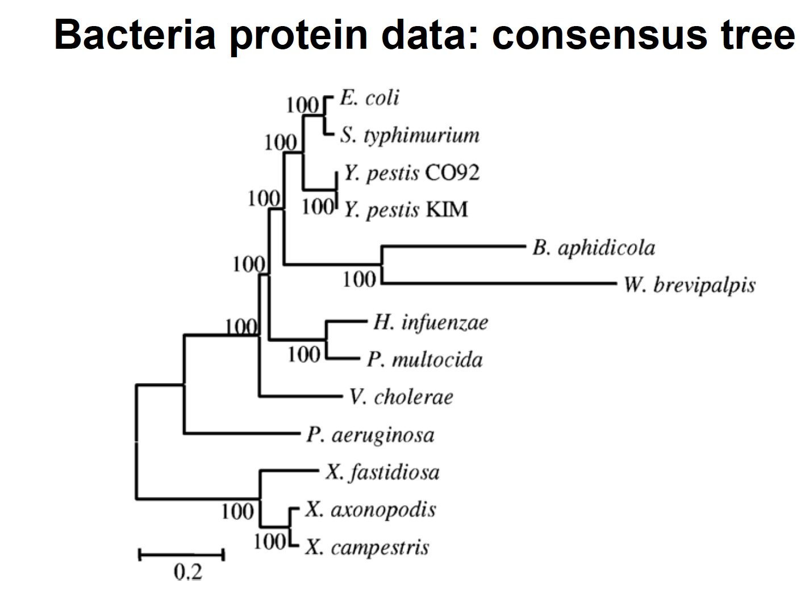

##### Inferring phylogenies using maximum likelihood
In this tutorial you will be guided in using PhyML and its extension, CodonPhyML, to solve common phylogenetic problems. For some of the following exercises there might be more than one single solution.

---

##### **Goal: Re-Analyzing real datasets**

 Reanalyse the protein data sets from Lerat et al. (2003) “From gene trees to organismal phylogeny in Prokaryotes: The case of the gammaTProteobacteria.” PLoS Biology 1:101T109

---

    
Datasets

    

        Dataset file: 

          <a href="#" class="btn btn-default">Prot_biob.phy</a>
          <a href="#" class="btn btn-default dropdown-toggle" data-toggle="dropdown"></a>
          <ul class="dropdown-menu">
            <li><a href="#">View</a></li>
            <li><a href="../../tutorial_data/tutorial01_phyml/Prot_biob.phy">Download</a></li>
          </ul>
        

    

---

### Fist Step

Infer the tree with a reasonable model (e.g. <em>LG+G</em>)

### Second Step

Search for the best model using ProtTest, and construct the corresponding tree 


### Third Step

Display the tree in a nice and meaningful way (eg, using Figtree or any other program)

---

    
Tasks

    

    <ol>
      <li>Look into the stat file, what can you tell based on the ML estimates?</li>
      <li>Are you able to recover the HGT (horizontal gene transfer) published by Lerat et al.? See figure 1</li>
    </ol>
    

---
#### **Figure 1**

---

This exercise was prepared by *Maria Anisimova*
