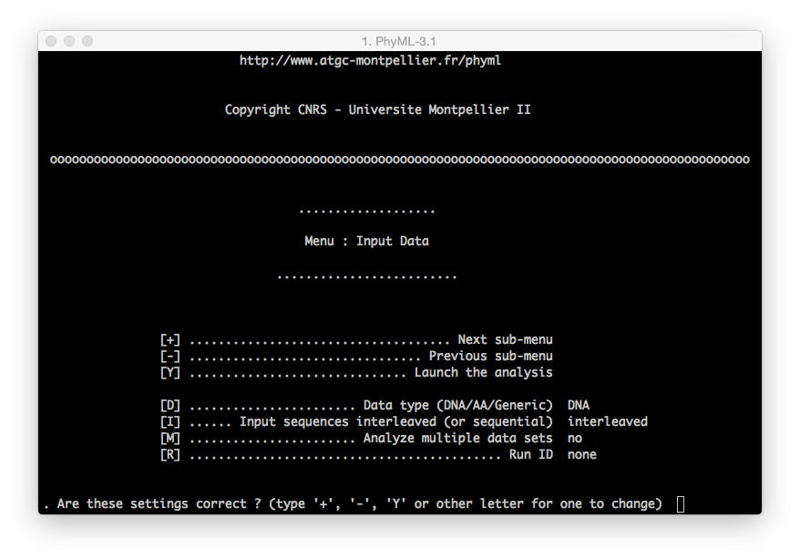

##### Getting started with PhyML

###### **1. Download the software**

<a href="http://www.atgc-montpellier.fr/phyml/download.php">http://www.atgc-montpellier.fr/phyml/download.php</a>

###### **2. Launch**

<ul>
<li>
<code>PhyML</code> runs without a <a href="https://en.wikipedia.org/wiki/Graphical_user_interface">graphical user interface (GUI)</a>. Therefore, you will see a black terminal window appearing on your monitor anytime you execute it. 

<em>WARN: On Windows machines <code>PhyML</code> will close automatically the terminal session at the end of the execution.</em> 
</li>
</ul>

<blockquote>
  
<strong>PhyML execution can be started either with:</strong>

  <ul>
  <li>a double click on <em>PhyML-3.1_your-operative-system</em> (i.e. <code>PhyML-3.1_linux64</code>)</li>
  </ul>

  
<strong>or:</strong> 

  <ul>
  <li>dragging <em>PhyML-3.1_your-operative-system</em> (i.e. <code>PhyML-3.1_linux64</code>) into a new terminal session (on OsX and Linux operative systems search for <code>Terminal</code>).</li>
  </ul>
</blockquote>

###### **3. Interface**

PhyML allows the user to prepare the analysis with two different interfaces:

<ul>
<li><strong>Menu</strong>: this interface will be loaded once the user provides a valid alignment file   
<em>(WARN: remember the difference between <code>interleaved</code> and <code>sequential</code> files).</em></li>
</ul>

<blockquote>
  
You can move between menus using the <code>+</code> and <code>-</code> key on your keyboard and pressing <code>enter</code> to confirm the command. 

  
To modify a command (i.e. modify the substitution model from the default to GTR):

<pre><code> [M] ................. Model of nucleotide substitution  HKY85
</code></pre>

  
you need to press the following sequence of keys on your keyboard:

  
<code>m</code> + <code>enter</code> |   The model will be changed into F84  
  <code>m</code> + <code>enter</code> |   The model will be changed into TN93  
  <code>m</code> + <code>enter</code> |   The model will be changed into GTR  

  
The same procedure applies for all the other commands. 

</blockquote>

<ul>
<li><strong>Command Line</strong>: this interface allows the user to set all the configuration parameters in one single step, dynamically but not interactively.</li>
</ul>

<blockquote>
  
You an find more informations here:  
  <a href="http://www.atgc-montpellier.fr/phyml/usersguide.php?type=command">http://www.atgc-montpellier.fr/phyml/usersguide.php?type=command</a>

</blockquote>

<h4 id="references">References</h4>

<ol>
<li>PhyML, a tool for biologists <a href="http://www2.cnrs.fr/en/454.htm">http://www2.cnrs.fr/en/454.htm</a></li>
</ol>

