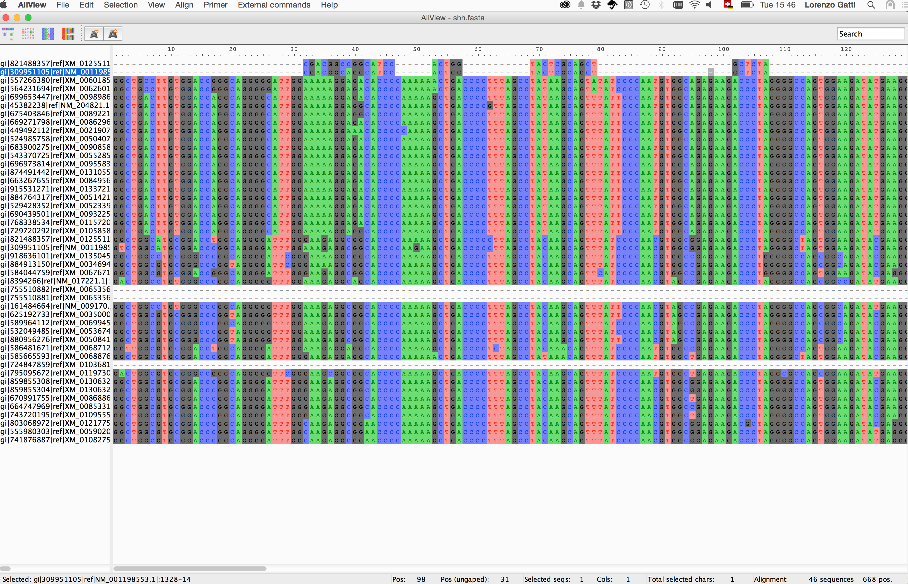
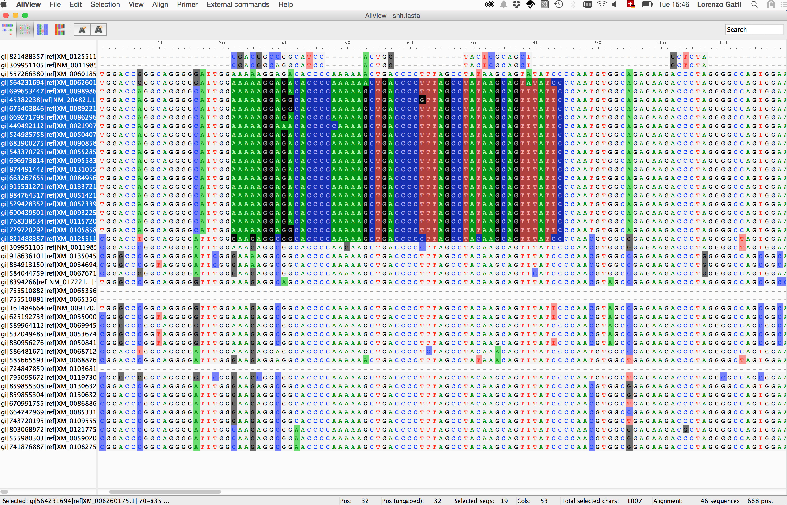
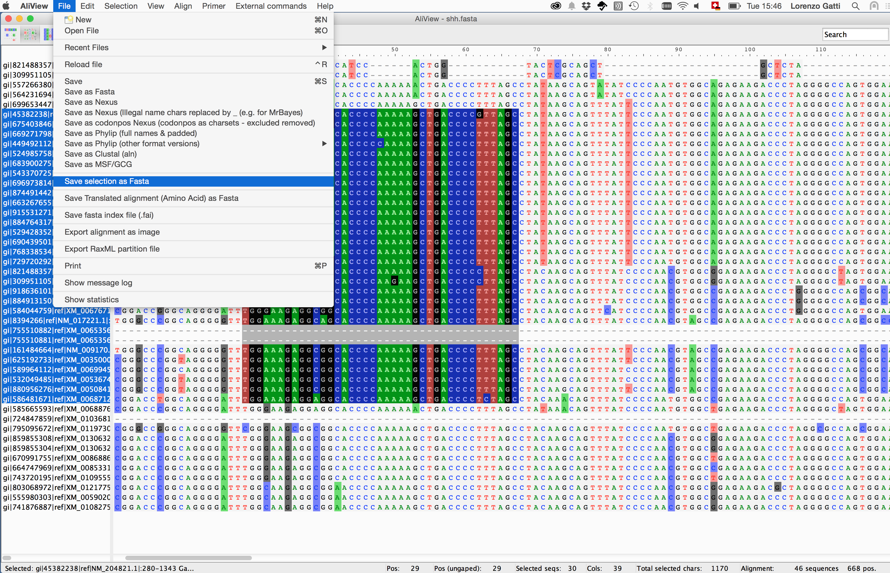
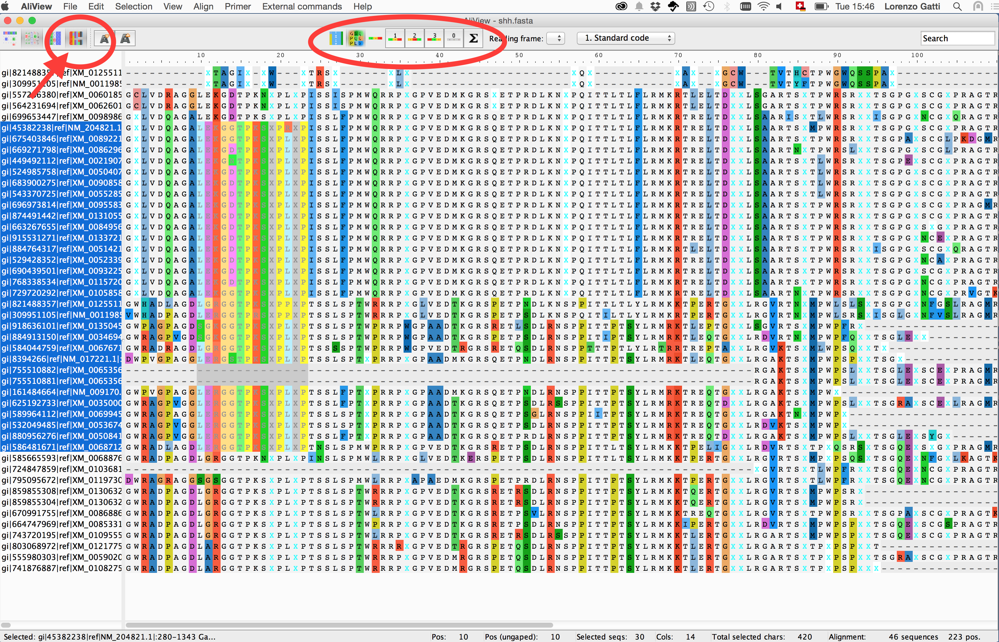
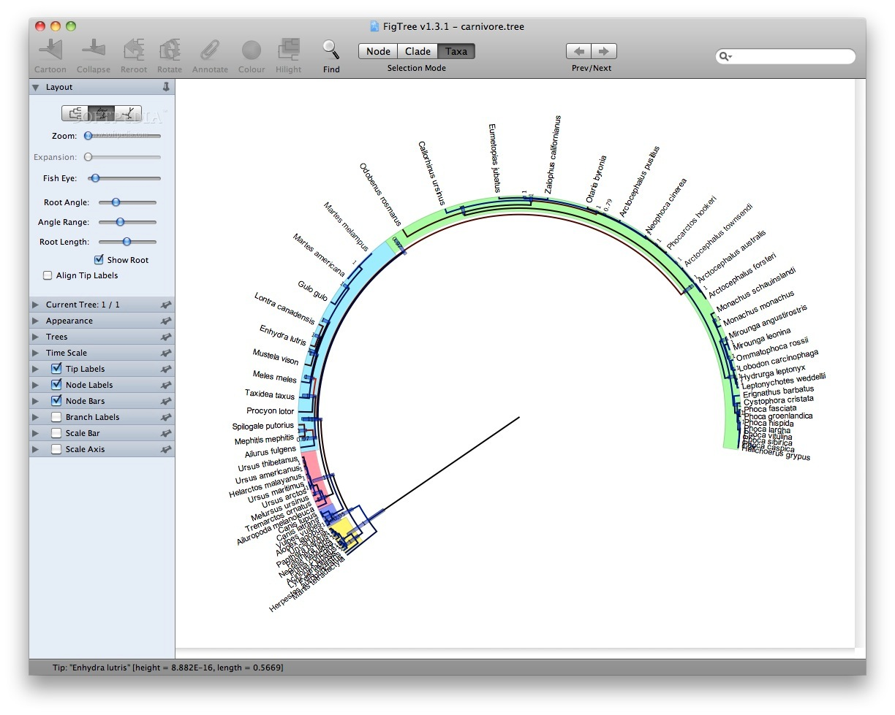

### Visualising Multi-Sequence-Alignments using Aliview

Discovering nucleotide/amino-acid variations in a MSA can be tricky. One way to help the user to overcome
this issue is using dedicated softwares that allow basic operations on the MSA object (i.e. alignment browsing,
coloring, indexing and nucleotide/amino-acid translation).

#### 1. Open a MSA file

#### 2. Perform a view

#### 3. Extract view

#### 4. Summary statistics on the view

#### 5. Translate a selection view using different codon frames

---
#### Other visualization softwares
You can find a list of MSA visualizers here:  https://en.wikipedia.org/wiki/List_of_alignment_visualization_software

---

### Visualizing phylogenetic trees with FigTree

