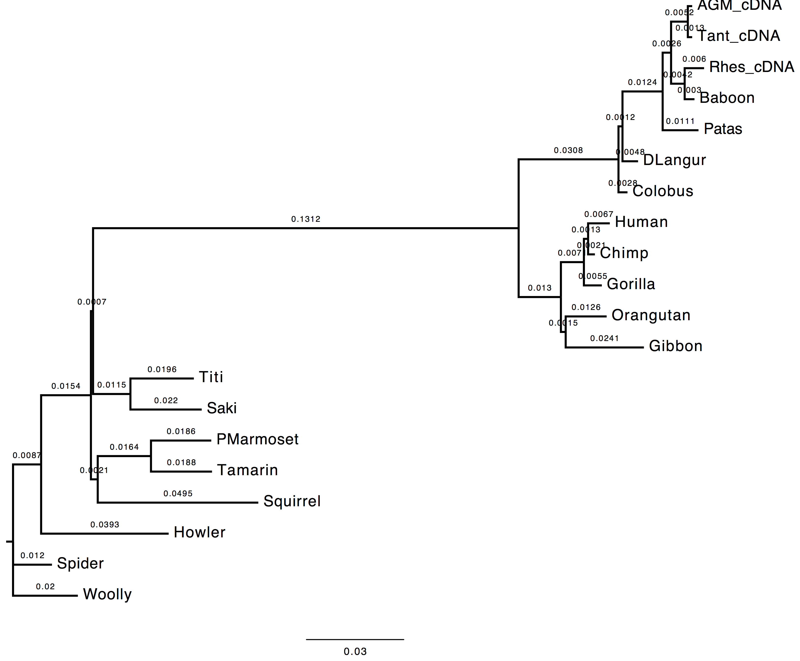
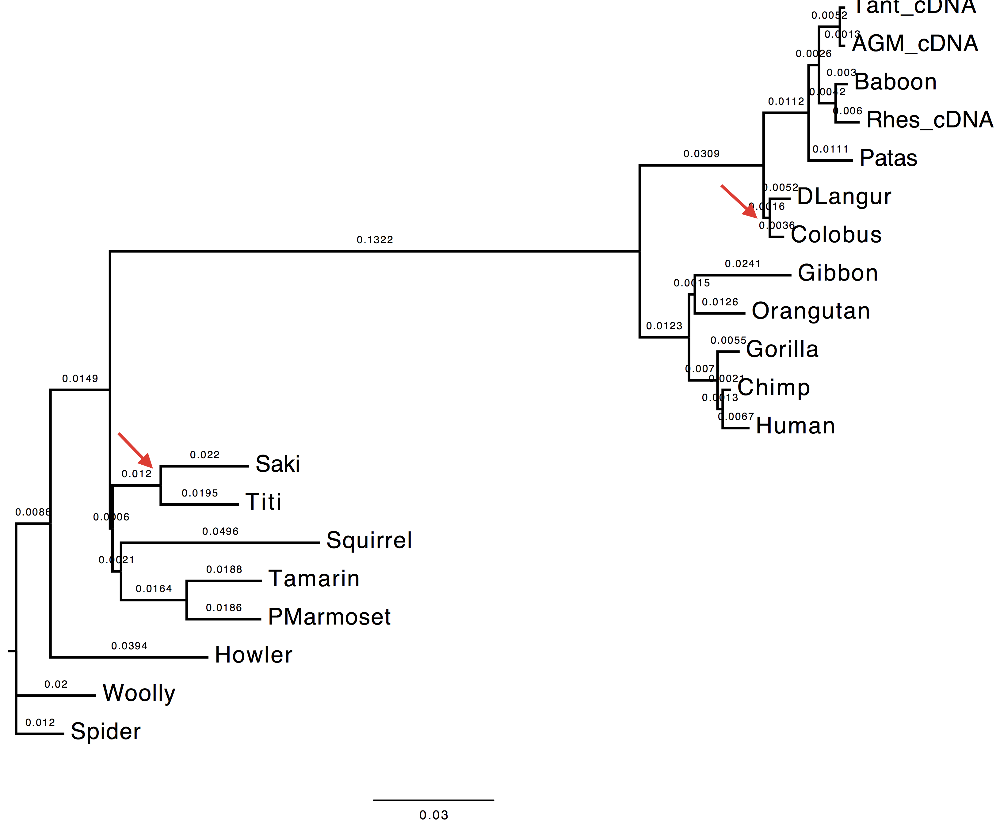

##### Inferring phylogenies using maximum likelihood
###### **Observing the effect of tree search routines on the initial inferred tree topology.**

 

#### Goals

In this exercise you are asked to optimise the tree topology on the substitution parameters obtained using ML performing a tree search (i.e. NNI, SPR, TBR) on the initial tree topology.

---

    
Datasets

    

        Dataset file: 

          <a href="#" class="btn btn-default">primates-nt.phy</a>
          <a href="#" class="btn btn-default dropdown-toggle" data-toggle="dropdown"></a>
          <ul class="dropdown-menu">
            <li><a href="#">View</a></li>
            <li><a href="#">Download</a></li>
          </ul>
        

    

---

<h5 id="execution-1">Execution</h5>

<strong>1. Run</strong>

<ul>
<li>Nucleotide substitution model = <em>HKY85 + Gamma</em></li>
<li>Estimating <em>transition/transversion</em> ratio ( parameter of HKY85 model)</li>
<li>Estimating <em>alpha</em> parameter (remember  for gamma distributions used in phylogenetics)</li>
<li>Estimating <em>nucleotide frequencies</em> <strong>with ML</strong></li>
<li>No <em>tree search</em> (tree optimisation)</li>
</ul>

Here is the list of the parameters to change from the PhyML menu:

From 2nd menu

<pre><code>[M] ................. Model of nucleotide substitution  HKY85
[F] ................. Optimise equilibrium frequencies  yes
[T] .................... Ts/tv ratio (fixed/estimated)  estimated
[C] ........... Number of substitution rate categories  4
[G] ............. Gamma distributed rates across sites  yes
[A] ... Gamma distribution parameter (fixed/estimated)  estimated
</code></pre>

From 3rd menu

<pre><code>[O] ........................... Optimise tree topoLOGy  no
</code></pre>

---

<h5 id="questions-1">Questions</h5>

<strong>1. Compare the trees obtained with and without tree-search. What do you observe and why?</strong>

The topology inferred without tree search presents a variation in the internal node attribution for the clades (Saki,Titi).

<table>
<thead>
<tr>
  <th>With <em>tree-search</em></th>
  <th>Without <em>tree-search</em></th>
</tr>
</thead>
<tbody><tr>
  <td></td>
  <td></td>
</tr>
</tbody></table>

<strong>2. Compare the model estimates with and without tree-search. What do you observe and why?</strong>

The transition/transversion ratio differs slightly between the two runs. As the matter of fact,  parameter appears to have a higher value when tree-search is not performed.

<strong>3. Compare the likelihood of the ML and NJ trees. What do you observe and why?</strong>

The likelihood value obtained without tree-search is lower than the value obtain performing the topology optimisation. This value is expected since the substitution parameters are optimised over the first inferred tree topology which did not undergo any refinement.

<pre><code>    with tree-search: -6172.58045
    without tree-search: -6173.00555
</code></pre>

---

phylogenies
tree-estimation
maximum-likelihood
parameter-estimation

